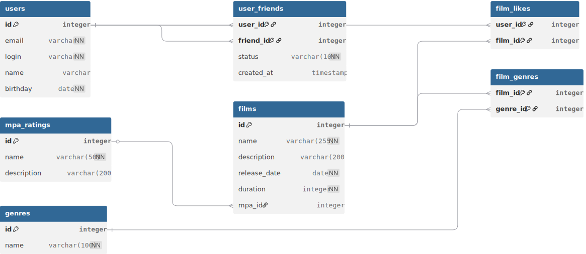

# Filmorate Database Schema

## 📊 Схема базы данных

Ниже представлена диаграмма базы данных проекта Filmorate, разработанная с учетом требований нормализации и бизнес-логики приложения.



*Для интерактивного просмотра и редактирования схемы перейдите по ссылке: [Filmorate DB schema on dbdiagram.io](https://dbdiagram.io/d/ваш_уникальный_ключ_схемы)*

### 📝 Описание таблиц

| Таблица | Назначение |
|---------|------------|
| `users` | Хранит информацию о пользователях (email, логин, имя, дата рождения) |
| `films` | Содержит данные о фильмах (название, описание, дата релиза, длительность) |
| `mpa_ratings` | Справочник рейтингов MPA (G, PG, PG-13, R, NC-17) |
| `genres` | Справочник жанров (Комедия, Драма, Мультфильм и т.д.) |
| `film_genres` | Связующая таблица для отношения "многие-ко-многим" между фильмами и жанрами |
| `film_likes` | Хранит лайки пользователей к фильмам |
| `user_friends` | Управляет дружескими связями между пользователями со статусами PENDING/CONFIRMED |

### 🔗 Ключевые связи

- `films.mpa_id` → `mpa_ratings.id` (многие-к-одному)
- `films` ←→ `genres` через `film_genres` (многие-ко-многим)
- `films` ←→ `users` через `film_likes` (многие-ко-многим)
- `users` ←→ `users` через `user_friends` (рекурсивная связь многие-ко-многим)

## 📋 Примеры SQL-запросов для основных операций

### Получение всех фильмов с их рейтингами MPA
```sql
SELECT f.*, mr.name AS mpa_name, mr.description AS mpa_description
FROM films f
LEFT JOIN mpa_ratings mr ON f.mpa_id = mr.id;
```

### Получение всех пользователей
```sql
SELECT * FROM users;
```

### Получение фильма по ID с его жанрами
```sql
SELECT f.*, 
       mr.name AS mpa_name,
       mr.description AS mpa_description,
       g.id AS genre_id,
       g.name AS genre_name
FROM films f
LEFT JOIN mpa_ratings mr ON f.mpa_id = mr.id
LEFT JOIN film_genres fg ON f.id = fg.film_id
LEFT JOIN genres g ON fg.genre_id = g.id
WHERE f.id = ?;
```

### Топ N популярных фильмов (по количеству лайков)
```sql
SELECT f.id, f.name, f.description, COUNT(fl.user_id) AS likes_count
FROM films f
LEFT JOIN film_likes fl ON f.id = fl.film_id
GROUP BY f.id
ORDER BY likes_count DESC
LIMIT ?;
```

### Добавление лайка фильму
```sql
INSERT INTO film_likes (film_id, user_id)
VALUES (?, ?);
```

### Удаление лайка
```sql
DELETE FROM film_likes
WHERE film_id = ? AND user_id = ?;
```

### Получение всех друзей пользователя
```sql
SELECT u.*
FROM users u
WHERE u.id IN (
    SELECT friend_id
    FROM user_friends
    WHERE user_id = ? AND status = 'CONFIRMED'
);
```

### Получение списка общих друзей с другим пользователем
```sql
SELECT u.*
FROM users u
WHERE u.id IN (
    -- Друзья первого пользователя
    SELECT friend_id 
    FROM user_friends 
    WHERE user_id = ? AND status = 'CONFIRMED'
    INTERSECT
    -- Друзья второго пользователя
    SELECT friend_id 
    FROM user_friends 
    WHERE user_id = ? AND status = 'CONFIRMED'
);
```

### Добавление запроса в друзья
```sql
INSERT INTO user_friends (user_id, friend_id, status)
VALUES (?, ?, 'PENDING');
```

### Подтверждение дружбы
```sql
UPDATE user_friends
SET status = 'CONFIRMED'
WHERE user_id = ? AND friend_id = ?;
```

### Удаление из друзей
```sql
DELETE FROM user_friends
WHERE (user_id = ? AND friend_id = ?) OR (user_id = ? AND friend_id = ?);
```
